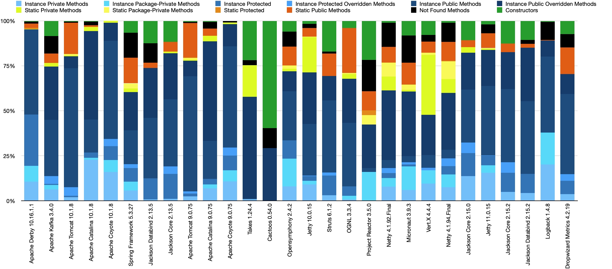

# Statistics of application methods profiling

This repository contains the code that aggregates the profiling results received
during the profiling of different applications (see
[cost-of-oop](../cost-of-oop/README.md) for profiling
scripts and applications). The final results of method usage is presented in the
following histogram:

On the X axis you can see the list of libraries that was analysed.
On the Y axis you can see the percent of methods that were used in the
application in the corresponding library.

If you need aggregated data for the future analysis you can download the raw
CSV file [here](libraries-new.csv). The columns of the CSV file are:

- **Application** - the name of the tested application
- **Total** - total number of methods that were counted during
  profiling (including lambdas, constructors, static/instance methods)
- **Instance Private Methods** - total number of private instance methods that
  were counted during profiling
- **Instance Package-Private Methods** - total number of package-private
  instance methods that were counted during profiling
- **Instance Protected Methods** - total number of protected instance methods
  that were counted during profiling
- **Instance Protected Overridden Methods** - total number of protected
  instance methods that were counted during profiling that were overridden in
  the subclasses
- **Instance Public Methods** - total number of public instance methods that
  were counted during profiling
- **Instance Public Overridden Methods** - total number of public instance
  methods that were counted during profiling that were overridden in the
  subclasses
- **Static Private Methods** - total number of private static methods that
  were counted during profiling
- **Static Package-Private Methods** - total number of package-private static
  methods that were counted during profiling
- **Static Protected Methods** - total number of protected static methods that
  were counted during profiling
- **Static Public Methods** - total number of public static methods that were
  counted during profiling
- **Not Found Methods** - total number of methods that were not found in the
  source code (labdas, or methods in the inner classes).
- **Constructors** - total number of constructors that were counted during
  profiling
- **Instance Private Methods, %** - percent of private instance methods
  (Instance Private Methods / Total)
- **Instance Package-Private Methods, %** - percent of package-private instance
  methods (Instance Package-Private Methods / Total)
- **Instance Protected Methods, %** - percent of protected instance methods
  (Instance Protected Methods / Total)
- **Instance Protected Overridden, %** - percent of protected instance methods
  that were overridden in the subclasses (Instance Protected Overridden Methods
  / Total)
- **Instance Public Methods, %** - percent of public instance methods
  (Instance Public Methods / Total)
- **Instance Public Overridden Methods, %** - percent of public instance
  methods that were overridden in the subclasses (Instance Public Overridden
  Methods / Total)
- **Static Private Methods, %** - percent of private static methods (Static
  Private Methods / Total)
- **Static Package-Private Methods, %** - percent of package-private static
  methods (Static Package-Private Methods / Total)
- **Static Protected, %** - percent of protected static methods (Static
  Protected Methods / Total)
- **Static Public Methods, %** - percent of public static methods (Static
  Public Methods / Total)
- **Not Found Methods, %** - percent of methods that were not found in the
  source code (labdas, or methods in the inner classes) (Not
  Found Methods / Total)
- **Constructors, %** - percent of constructors (Constructors / Total)
- **GitHub Forks** - number of forks of the application repository on GitHub
- **GitHub Stars** - number of stars of the application repository on GitHub
- **GitHub Open Issues** - number of open issues of the application repository
  on GitHub
- **GitHub Size (KB)** - size of the application repository on GitHub
- **GitHub Age (ms)** - age of the application repository on GitHub

The raw profiling results by methods you can
get [here](https://github.com/volodya-lombrozo/cost-of-oop/tree/main/results)

## Files of the repository

- [src](src) - the source code of the module, which contains plain Java code
  that aggregates the profiling results obtained during the profiling of various
  applications.

- [libraries.csv](libraries.csv) - the initial data from the profiling results.
  This data is retained for historical purposes only. **DO NOT USE THEM FOR
  ANALYSIS**.

- [libraries-new.csv](libraries-new.csv) - the final aggregated data of the
  profiling results by libraries. The columns of the CSV file are described
  [above](#statistics-of-application-methods-profiling).
  Other files with similar names, such
  as [libraries-news.for.paper.numbers](libraries-news.for.paper.numbers),
  [libraries-new.numbers](libraries-new.numbers), [libraries-new-chart.jpg](libraries-new-chart.jpg),
  [statistics.data.histogram.jpg](statistics.data.histogram.jpg) are just
  different visual representations of the same data.

- [verification.csv](verification.csv) is file contains the technical
  verification data produced to check the correctness of the aggregation and
  profiling processes. Specifically, profiling was applied to handwritten
  classes for which we know
  the [exact number of methods and their types](../cost-of-oop/src/main/java/verification).

- [correlation.csv](correlation.csv) - this file shows the correlation between
  the number of methods and GitHub repository statistics such as the number of
  stars, forks, issues, size, and age of the application repository on GitHub.
  This could be interesting for future research.

## Ancestor

This submodule was originally a standalone repository is still
available [here](https://github.com/volodya-lombrozo/oop-statistics-filter).